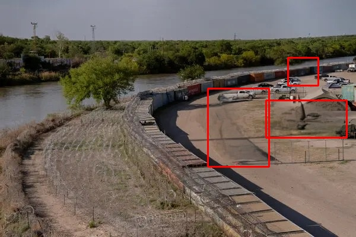

# Change-In-Image-Highlight

A Python program that detects and highlights differences between two similar images with colored shapes for easy visualization.

## Features
- Compares two similar images and highlights the differences
- Uses OpenCV for image processing
- Generates output images with highlighted changes
- Handles various types of image differences including missing elements and modifications

## Requirements
- Python 3.9+
- OpenCV
- NumPy
- Matplotlib

## Installation
1. Clone the repository:
   ```
   git clone https://github.com/GildArtsActive/Change-In-Image-Highlight.git
   cd Change-In-Image-Highlight
   ```

2. Install the required packages:
   ```
   pip install -r requirements.txt
   ```

## Usage
1. Place your original and modified images in the `input-images` directory
2. Run the script:
   ```
   python task_2_code.py
   ```
3. Check the `task_2_output` directory for the processed images with highlighted changes

## Example

### Input Images
1. Original Image (`input-images/1.jpg`)
   
   

2. Modified Image (`input-images/1~2.jpg`)
   
   


In the output image above, you can see:
- 🔴 Red rectangles: Added elements
- 🟢 Green rectangles: Removed elements
- 🔵 Blue rectangles: Modified elements

## Output
- The program generates output images with the following highlights:
  - Red rectangles around added elements
  - Green rectangles around removed elements
  - Blue rectangles around modified elements

## Note
- Ensure images are of the same dimensions for accurate comparison
- The program works best with high-quality images


